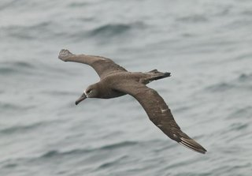
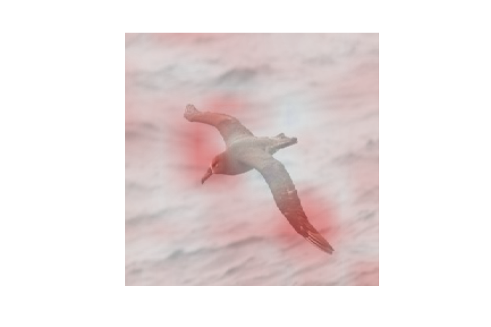

## [Origial Paper] Grad-CAM: Gradient-weighted Class Activation Mapping

**[Grad-CAM: Why did you say that? Visual Explanations from Deep Networks via Gradient-based Localization][7]**  
Ramprasaath R. Selvaraju, Abhishek Das, Ramakrishna Vedantam, Michael Cogswell, Devi Parikh, Dhruv Batra  
[https://arxiv.org/abs/1610.02391][7]

## Results

